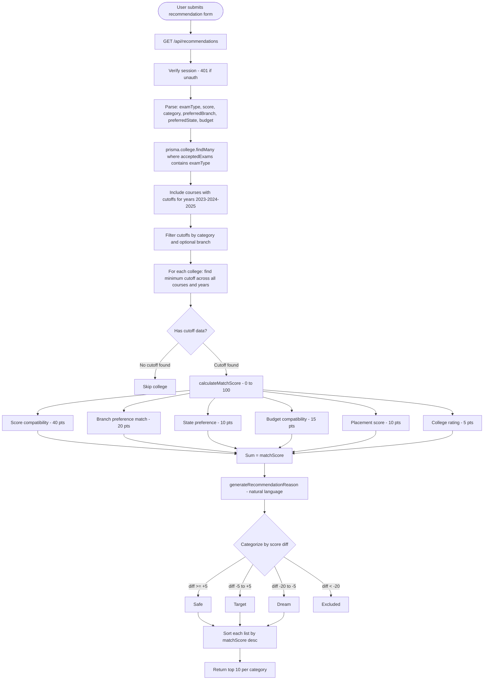
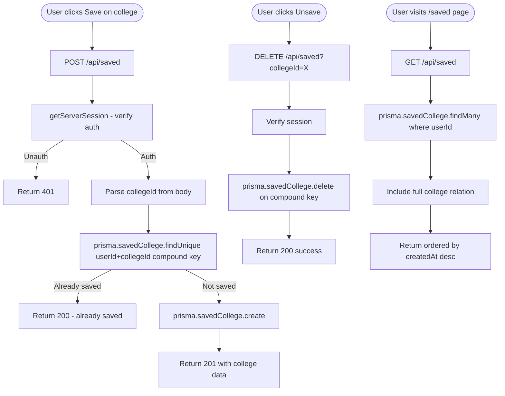
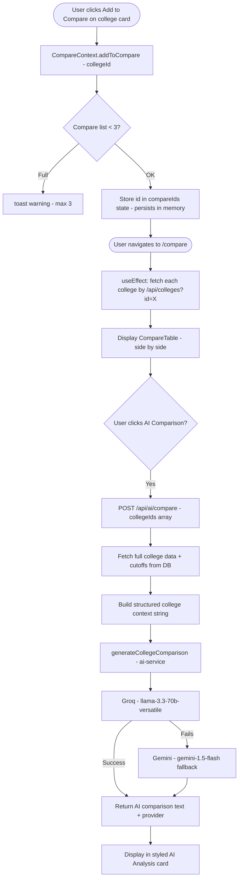
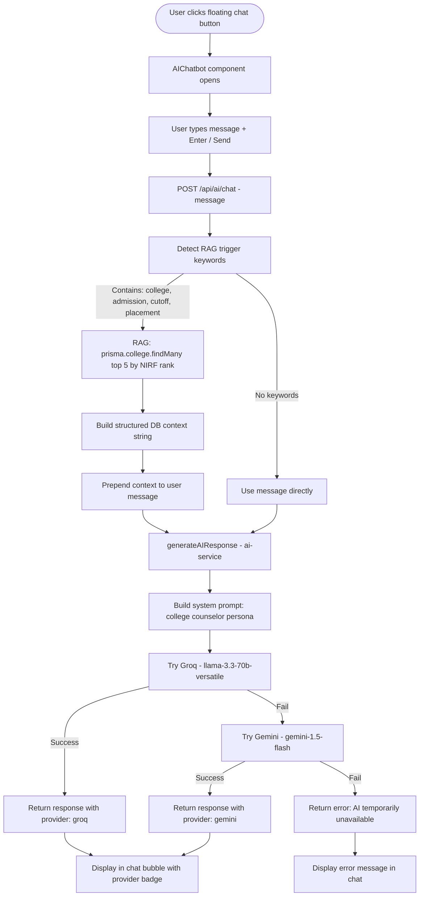
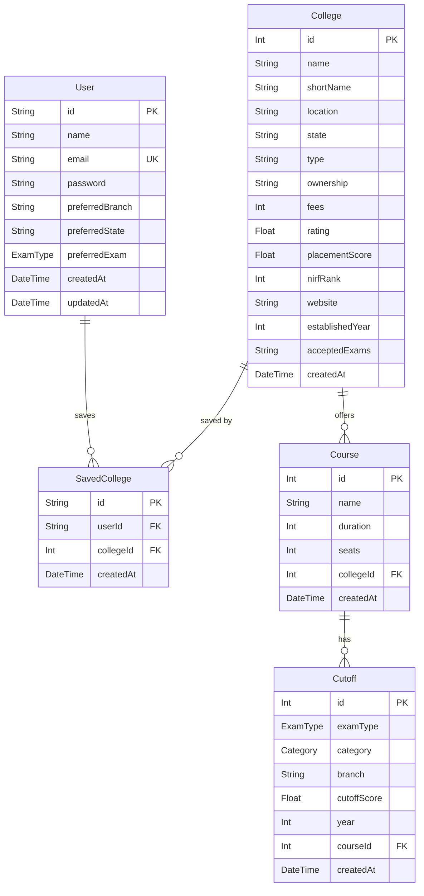
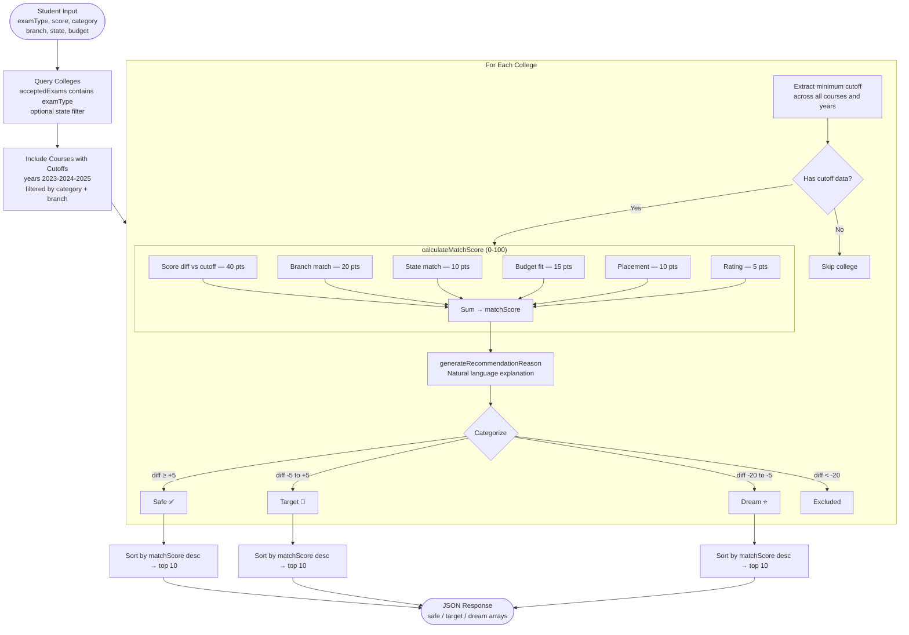
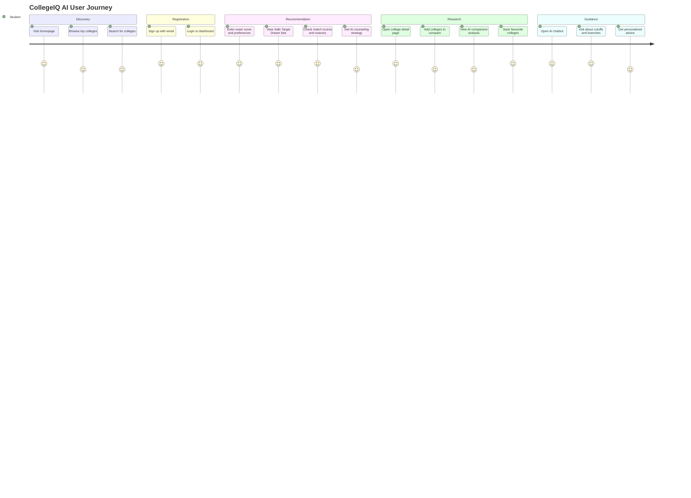
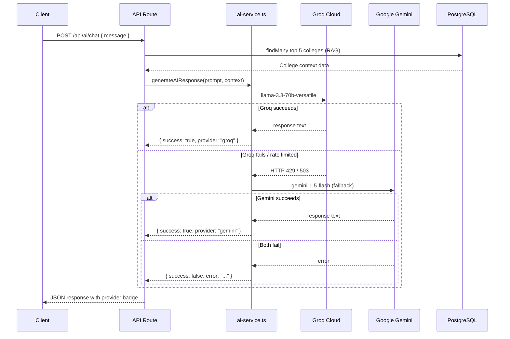

# PROJECT_ARCHITECTURE.md
## CollegeIQ AI — Complete Technical Architecture

---

# SECTION 1 — PROJECT OVERVIEW

## Project Name
**CollegeIQ AI** — AI-Powered College Discovery & Counseling Platform

## Problem Statement
Indian engineering students face a fragmented, information-overloaded college selection process. Cutoff data is spread across multiple sources, comparison is manual, and personalized guidance is either expensive (private counselors) or unreliable (generic websites). Students with valid scores often miss colleges they would qualify for, or apply to colleges far out of their reach.

## Objectives
- Centralize college data, cutoff records, and placement statistics in one platform
- Provide a rule-based recommendation engine that categorizes colleges into Safe / Target / Dream based on actual cutoff data
- Deliver an AI-powered counseling chatbot available to every student at zero marginal cost
- Enable side-by-side college comparison with AI-generated insights
- Support MHT-CET, JEE Main, and JEE Advanced exam types with category-level cutoffs (OPEN, OBC, EWS, SC, ST)

## Key Features
| Feature | Description |
|---|---|
| College Discovery | Browse 85+ colleges with NIRF rank, rating, fees, placement data |
| Smart Search | Keyword-aware search with exam, branch, budget, and location detection |
| AI Recommendations | Rule-based engine producing Safe / Target / Dream lists with match scores |
| Match Score (0–100) | Composite score across exam compatibility, branch, state, budget, placement |
| Why Recommended | Per-college natural language explanation generated from scoring logic |
| AI Chatbot | Floating RAG-powered counselor backed by Groq (primary) + Gemini (fallback) |
| College Compare | Side-by-side table + AI-generated strengths, weaknesses, and recommendation |
| AI Counseling Strategy | Personalised form-filling strategy based on recommendation results |
| Save Colleges | Authenticated users can bookmark colleges |
| User Profile | Store preferred branch, state, and exam type |

## Tech Stack
| Layer | Technology |
|---|---|
| Framework | Next.js 16 (App Router) |
| Language | TypeScript |
| Styling | Tailwind CSS |
| ORM | Prisma |
| Database | PostgreSQL (Neon serverless) |
| Authentication | NextAuth.js v4 (JWT + CredentialsProvider) |
| Password Hashing | bcryptjs |
| Primary LLM | Groq — `llama-3.3-70b-versatile` |
| Fallback LLM | Google Gemini — `gemini-1.5-flash` |
| AI SDK (Gemini) | `@google/generative-ai` |
| State Management | React Context (CompareContext), React useState |
| Form Validation | Zod |
| Toast Notifications | react-hot-toast |
| Deployment | Vercel-compatible (Next.js native) |

---

# SECTION 2 — SYSTEM ARCHITECTURE

## Layer Descriptions

### Frontend Layer
Built with Next.js 16 App Router using a split layout strategy:
- **Public routes** (`/`, `/colleges`, `/colleges/[id]`, `/login`, `/signup`) use the public `Navbar` + `Footer` layout
- **Protected routes** (`/dashboard`, `/recommendations`, `/compare`, `/saved`, `/profile`) use the `(dashboard)` route group with a persistent `Sidebar` layout
- The `AIChatbot` floating component is mounted globally in `app/layout.tsx`, available on every page
- Client state is managed via `SessionProvider` (NextAuth) and `CompareProvider` (custom context) wrapped in `app/providers.tsx`

### API Layer
All business logic is handled through Next.js Route Handlers under `app/api/`. Routes are divided into:
- Auth routes: signup and NextAuth handler
- Data routes: colleges, saved, recommendations, user profile
- AI routes: chat, compare, counseling, search

### Authentication Layer
NextAuth.js with JWT strategy. Sessions expire after 30 days. `CredentialsProvider` handles email/password login. The JWT callback embeds `id`, `email`, and `name` into the token. Server-side session retrieval uses `getServerSession(authOptions)`. Dashboard routes enforce authentication client-side via `useSession` in the dashboard layout.

### Database Layer
PostgreSQL hosted on Neon (serverless). Prisma ORM handles schema management, migrations, and type-safe queries. A singleton Prisma client is used via `globalThis` to prevent connection exhaustion in Next.js hot-reload environments.

### AI Layer
A unified `lib/ai-service.ts` module provides all AI functionality:
- `generateAIResponse()` — Groq primary, Gemini fallback
- `calculateMatchScore()` — pure function, no LLM
- `generateRecommendationReason()` — pure function, no LLM
- `generateCollegeComparison()` — calls `generateAIResponse` with college context
- `generateCounselingGuidance()` — calls `generateAIResponse` with student profile context

### External Services
| Service | Purpose | Key |
|---|---|---|
| Groq Cloud | Primary LLM inference (llama-3.3-70b-versatile) | `GROQ_API_KEY` |
| Google Gemini | Fallback LLM inference (gemini-1.5-flash) | `GEMINI_API_KEY` |
| Neon PostgreSQL | Serverless database hosting | `DATABASE_URL` |

## High-Level Architecture Diagram

```mermaid
graph TB
    subgraph Client["Browser / Client"]
        UI[Next.js Frontend<br/>React Components]
        CC[CompareContext<br/>React State]
        SP[SessionProvider<br/>NextAuth Client]
    end

    subgraph Server["Next.js Server (App Router)"]
        PG[Public Pages<br/>/ /colleges /login /signup]
        DB_PAGES[Dashboard Pages<br/>/dashboard /recommendations<br/>/compare /saved /profile]
        AUTH_MW[Dashboard Layout<br/>Auth Guard]

        subgraph API["API Routes /api/..."]
            AUTH_API[/api/auth/...<br/>NextAuth + Signup]
            COL_API[/api/colleges<br/>Search & Filter]
            REC_API[/api/recommendations<br/>Rule-Based Engine]
            SAVE_API[/api/saved<br/>Save/Unsave]
            USER_API[/api/user/profile<br/>Profile CRUD]
            AI_CHAT[/api/ai/chat<br/>RAG Chatbot]
            AI_COMP[/api/ai/compare<br/>AI Comparison]
            AI_COUNS[/api/ai/counseling<br/>Counseling Strategy]
            AI_SRCH[/api/ai/search<br/>Smart Search]
        end

        subgraph Services["lib/ Services"]
            AI_SVC[ai-service.ts<br/>Groq + Gemini]
            PRISMA_SVC[prisma.ts<br/>DB Singleton]
            AUTH_SVC[auth.ts<br/>Session Helper]
            VAL_SVC[validations.ts<br/>Zod Schemas]
        end
    end

    subgraph External["External Services"]
        GROQ[Groq Cloud<br/>llama-3.3-70b-versatile]
        GEMINI[Google Gemini<br/>gemini-1.5-flash]
        NEON[(Neon PostgreSQL<br/>Serverless DB)]
    end

    UI --> PG
    UI --> DB_PAGES
    DB_PAGES --> AUTH_MW
    UI --> AUTH_API
    UI --> COL_API
    UI --> REC_API
    UI --> SAVE_API
    UI --> USER_API
    UI --> AI_CHAT
    UI --> AI_COMP
    UI --> AI_COUNS
    UI --> AI_SRCH

    AUTH_API --> PRISMA_SVC
    COL_API --> PRISMA_SVC
    REC_API --> PRISMA_SVC
    REC_API --> AI_SVC
    SAVE_API --> PRISMA_SVC
    USER_API --> PRISMA_SVC
    AI_CHAT --> PRISMA_SVC
    AI_CHAT --> AI_SVC
    AI_COMP --> PRISMA_SVC
    AI_COMP --> AI_SVC
    AI_COUNS --> AI_SVC
    AI_SRCH --> PRISMA_SVC

    PRISMA_SVC --> NEON
    AI_SVC -->|Primary| GROQ
    AI_SVC -->|Fallback| GEMINI
```

---

# SECTION 3 — APPLICATION FLOWS

## 3.1 User Authentication Flow

```mermaid
flowchart TD
    A([User visits /login or /signup]) --> B{New or Returning?}
    B -->|New User| C[/signup page]
    B -->|Returning| D[/login page]

    C --> C1[Enter name, email, password]
    C1 --> C2[POST /api/auth/signup]
    C2 --> C3[Check duplicate email in DB]
    C3 -->|Exists| C4[Return 400 error]
    C3 -->|New| C5[bcrypt.hash password - 10 rounds]
    C5 --> C6[prisma.user.create]
    C6 --> C7[Return 201 success]
    C7 --> D

    D --> D1[Enter email + password]
    D1 --> D2[NextAuth signIn - CredentialsProvider]
    D2 --> D3[prisma.user.findUnique by email]
    D3 -->|Not found| D4[Throw Invalid credentials]
    D3 -->|Found| D5[bcrypt.compare password]
    D5 -->|Invalid| D4
    D5 -->|Valid| D6[Return user id, email, name]
    D6 --> D7[NextAuth creates JWT token]
    D7 --> D8[Session stored - 30 day expiry]
    D8 --> D9[Redirect to /dashboard]

    D4 --> D[/login page with error]
```

## 3.2 College Search Flow

```mermaid
flowchart TD
    A([User enters search query]) --> B[GET /api/colleges or /api/ai/search]
    
    B --> C{Which endpoint?}
    C -->|Basic filter| D[/api/colleges]
    C -->|Smart search| E[/api/ai/search]

    D --> D1[Parse: search, state, examType, course, page, limit]
    D1 --> D2[Build Prisma WhereInput]
    D2 --> D3[Add full-text OR on name, shortName, location]
    D3 --> D4[Filter acceptedExams contains examType]
    D4 --> D5[Filter courses.some for branch]
    D5 --> D6[prisma.college.findMany with pagination]
    D6 --> D7[Return colleges + totalPages]

    E --> E1[Parse natural language query]
    E1 --> E2[Detect exam keywords - jee, mht, iit]
    E2 --> E3[Detect branch keywords - cse, ai, mechanical]
    E3 --> E4[Detect budget - X lakh pattern]
    E4 --> E5[Detect intent - placement / top / affordable]
    E5 --> E6[Build dynamic where + orderBy]
    E6 --> E7[prisma.college.findMany - max 10]
    E7 --> E8[Return semantically ordered results]
```

## 3.3 Recommendation Flow



## 3.4 Save College Flow



## 3.5 Compare College Flow



## 3.6 AI Chatbot Flow



---

# SECTION 4 — DATABASE DESIGN

## Entity Descriptions

### User
Represents a registered student. Stores hashed password and optional academic preferences. One user can save many colleges.
- `id` — CUID string primary key
- `email` — unique, used for login
- `password` — bcrypt hashed
- `preferredBranch`, `preferredState`, `preferredExam` — optional personalization fields

### College
The core entity. Represents an engineering institution. Stores all static attributes including fees, rating, placement, and the `acceptedExams` comma-separated field that drives exam-type filtering.
- `acceptedExams` — e.g. `"MHT_CET,JEE_MAIN"` or `"JEE_ADVANCED"` — used with `contains` filter

### Course
A degree programme offered by a college (e.g. Computer Engineering, AI & Data Science). Each college has multiple courses. Each course has multiple cutoffs.

### Cutoff
Historical admission cutoff record scoped to a specific course, exam type, category, branch, and year. This is the core data the recommendation engine queries against.
- Indexed on `(examType, category, year)` for recommendation query performance
- Years covered: 2023, 2024, 2025

### SavedCollege
Junction table between User and College. Enforces a unique constraint on `(userId, collegeId)` to prevent duplicates.

## Relationships
- `User` 1 — N `SavedCollege`
- `College` 1 — N `SavedCollege`
- `College` 1 — N `Course`
- `Course` 1 — N `Cutoff`

## Database ER Diagram



## Enums
```
ExamType: MHT_CET | JEE_MAIN | JEE_ADVANCED
Category: OPEN | OBC | EWS | SC | ST
```

## Database Indexes
| Table | Index | Purpose |
|---|---|---|
| College | `state` | Filter by state in recommendations |
| College | `type` | Filter by college type |
| Course | `collegeId` | Join courses to college |
| Course | `name` | Branch name search |
| Cutoff | `courseId` | Join cutoffs to course |
| Cutoff | `(examType, category, year)` | Compound index for recommendation query |
| SavedCollege | `userId` | Fetch user's saved list |
| SavedCollege | `collegeId` | Check if college is saved |
| SavedCollege | `(userId, collegeId)` | Unique constraint + dedup check |

---

# SECTION 5 — RECOMMENDATION ENGINE

## Inputs (Query Parameters)
| Parameter | Type | Required | Description |
|---|---|---|---|
| `examType` | `MHT_CET \| JEE_MAIN \| JEE_ADVANCED` | Yes | Which entrance exam |
| `score` | `Float` | Yes | Student's percentile (0–100) |
| `category` | `OPEN \| OBC \| EWS \| SC \| ST` | No (default: OPEN) | Reservation category |
| `preferredBranch` | `String` | No | e.g. "Computer", "AI" |
| `preferredState` | `String` | No | e.g. "Maharashtra" |
| `budget` | `Float` | No | Max annual fees in ₹ |

## Processing Logic

**Step 1 — College filtering**
Query `College` table where `acceptedExams CONTAINS examType` (and optionally `state = preferredState`).

**Step 2 — Cutoff retrieval**
For each college, include `courses.cutoffs` filtered by `examType`, `category`, and `year IN [2023, 2024, 2025]`. If `preferredBranch` is supplied, additionally filter `branch CONTAINS preferredBranch`.

**Step 3 — Minimum cutoff extraction**
Iterate all cutoff records across all courses. Find the single lowest `cutoffScore` for that college. This becomes the comparison baseline.

**Step 4 — Match Score calculation** (`calculateMatchScore`)

| Dimension | Max Points | Logic |
|---|---|---|
| Score compatibility | 40 | diff ≥10 → 40, ≥5 → 35, ≥0 → 30, ≥-5 → 20, else → 10 |
| Branch preference | 20 | Exact branch found → 20, any course → 10, none → 0 |
| State preference | 10 | Match → 10, mismatch with pref → 5, no pref → 8 |
| Budget | 15 | Within budget → 15, within 120% → 10, within 150% → 5 |
| Placement score | 10 | ≥90% → 10, ≥80% → 8, ≥70% → 6, else → 4 |
| Rating | 5 | min(rating, 5) |
| **Total** | **100** | Capped at 100 |

**Step 5 — Categorization**
Based on `diff = userScore − minCutoff`:

| Category | Condition | Meaning |
|---|---|---|
| Safe ✅ | `diff >= +5` | Score comfortably above cutoff |
| Target 🎯 | `-5 <= diff < +5` | Score near cutoff — competitive |
| Dream ⭐ | `-20 <= diff < -5` | Score below cutoff — aspirational |
| Excluded | `diff < -20` | Too large a gap — not shown |

**Step 6 — Reason generation** (`generateRecommendationReason`)
Pure string function. Builds a natural language sentence from: score gap, placement tier, NIRF rank band, branch availability, and student rating. No LLM call.

**Step 7 — Sorting and limiting**
Each bucket sorted by `matchScore DESC`. Top 10 per category returned.

## Recommendation Engine Flow Diagram



---

# SECTION 6 — AI SYSTEM

## Groq Usage
- **Model**: `llama-3.3-70b-versatile`
- **Role**: Primary LLM for all generative tasks
- **Endpoint**: `https://api.groq.com/openai/v1/chat/completions`
- **Parameters**: `temperature: 0.7`, `max_tokens: 1024`
- **Invocation**: `callGroq(systemPrompt, userPrompt)` — throws on non-2xx response

## Gemini Usage
- **Model**: `gemini-1.5-flash`
- **Role**: Fallback LLM when Groq fails or rate-limits
- **SDK**: `@google/generative-ai`
- **Invocation**: `callGemini(fullPrompt)` — passes combined system + user prompt as single string

## Fallback Chain
```
Request → callGroq → Success → return { provider: 'groq' }
                  → Fail    → callGemini → Success → return { provider: 'gemini' }
                                         → Fail    → return { success: false, error: '...' }
```
The chatbot UI always shows the provider name (`via groq` / `via gemini`). The application never crashes — failures return a user-friendly error message.

## Prompt Flow

### Chatbot (RAG Pattern)
1. User sends message
2. API detects college-related keywords (`college`, `admission`, `cutoff`, `placement`)
3. If detected: query top 5 colleges by NIRF rank, build structured context block including name, fees, rating, placement, courses, and recent cutoffs
4. Combined prompt: `Context: [DB data]\n\nStudent question: [message]\n\nAnswer based on the context above.`
5. System prompt: `"You are a helpful college counseling assistant for Indian students..."`

### College Comparison
1. Receive array of college IDs (min 2)
2. Fetch full college data with courses and cutoffs from DB
3. Build numbered context block per college (name, fees, rating, placement, NIRF rank, type)
4. Prompt requests: strengths per college, weaknesses, placement comparison, fee-to-value, final recommendation

### Counseling Guidance
1. Receive: exam type, score, category, preferred branch, and the recommendation results (safe/target/dream arrays)
2. Build context: student profile + lists of safe/target/dream college short names
3. Prompt requests: admission chances, form-filling strategy, backup plan, branch vs college trade-off, one key tip

## Semantic Search
The `/api/ai/search` route implements keyword-based "semantic-like" search without embeddings. It parses natural language to detect:
- **Exam type**: `jee`, `mht`, `iit` → maps to enum values
- **Branch**: `cse`, `ai`, `data science`, `electronics` → maps to course name filter
- **Budget**: regex `(\d+) lakh` → converts to `fees <= maxBudget`
- **Intent**: `placement/job` → order by `placementScore DESC`; `top/best` → order by `nirfRank ASC, rating DESC`; `affordable/cheap` → order by `fees ASC`

## AI Architecture Diagram

```mermaid
graph TB
    subgraph UI["Frontend"]
        CHAT[AIChatbot Component<br/>Floating bottom-right]
        REC_PAGE[Recommendations Page<br/>Counseling button]
        COMP_PAGE[Compare Page<br/>AI Comparison button]
    end

    subgraph ROUTES["API Routes"]
        CHAT_RT[/api/ai/chat]
        COUNS_RT[/api/ai/counseling]
        COMP_RT[/api/ai/compare]
        SRCH_RT[/api/ai/search]
    end

    subgraph SERVICE["lib/ai-service.ts"]
        GAR[generateAIResponse\nGlobal entry point]
        GCC[generateCollegeComparison]
        GCG[generateCounselingGuidance]
        CMS[calculateMatchScore\nPure function]
        GRR[generateRecommendationReason\nPure function]

        subgraph LLM["LLM Dispatch"]
            GROQ[callGroq\nllama-3.3-70b-versatile\nPrimary]
            GEMINI[callGemini\ngemini-1.5-flash\nFallback]
        end
    end

    subgraph RAG["RAG - Retrieval Augmented Generation"]
        DB_QUERY[prisma.college.findMany\ntop 5 by NIRF rank]
        CTX[Build Context String\nname, fees, rating,\nplacement, cutoffs]
    end

    subgraph NEON[(Neon PostgreSQL)]
        COLLEGES_TBL[College Table]
        CUTOFFS_TBL[Cutoff Table]
    end

    CHAT -->|POST message| CHAT_RT
    REC_PAGE -->|POST student profile| COUNS_RT
    COMP_PAGE -->|POST college IDs| COMP_RT

    CHAT_RT --> RAG
    DB_QUERY --> COLLEGES_TBL & CUTOFFS_TBL
    CTX --> GAR

    CHAT_RT --> GAR
    COUNS_RT --> GCG --> GAR
    COMP_RT --> GCC --> GAR

    GAR --> GROQ
    GROQ -->|fail| GEMINI

    SRCH_RT --> COLLEGES_TBL
```

---

# SECTION 7 — API ARCHITECTURE

## Complete API Route Table

| Route | Method | Purpose | Auth Required |
|---|---|---|---|
| `/api/auth/[...nextauth]` | GET, POST | NextAuth session handler (login, session, signout) | No |
| `/api/auth/signup` | POST | Create new user account | No |
| `/api/colleges` | GET | Fetch colleges with search, filter, pagination | No |
| `/api/colleges?id=X` | GET | Fetch single college by ID with courses and cutoffs | No |
| `/api/recommendations` | GET | Rule-based AI recommendation engine | Yes |
| `/api/saved` | GET | Fetch authenticated user's saved colleges | Yes |
| `/api/saved` | POST | Save a college for the authenticated user | Yes |
| `/api/saved` | DELETE | Remove a saved college | Yes |
| `/api/user/profile` | GET | Fetch authenticated user profile | Yes |
| `/api/user/profile` | PUT | Update user profile preferences | Yes |
| `/api/ai/chat` | POST | RAG-powered college counseling chatbot | No |
| `/api/ai/compare` | POST | AI-generated college comparison analysis | No |
| `/api/ai/counseling` | POST | Personalised admission strategy guidance | Yes |
| `/api/ai/search` | GET | Smart keyword-aware college search | No |

## Request / Response Patterns

**Standard success response:**
```json
{ "success": true, "data": { ... } }
```

**Standard error response:**
```json
{ "success": false, "error": "Description" }
```

**Paginated response (`/api/colleges`):**
```json
{ "success": true, "total": 85, "page": 1, "limit": 20, "totalPages": 5, "data": [...] }
```

**Recommendations response:**
```json
{
  "success": true,
  "data": {
    "safe": [ { "id": 1, "matchScore": 87, "reason": "...", "cutoff": 94.2, ... } ],
    "target": [...],
    "dream": [...]
  }
}
```

---

# SECTION 8 — COMPONENT ARCHITECTURE

## Component Hierarchy

```
app/layout.tsx (RootLayout)
├── Providers (providers.tsx)
│   ├── SessionProvider         ← NextAuth session context
│   ├── CompareProvider         ← lib/compare-context.tsx
│   └── Toaster                 ← react-hot-toast
├── {children}
│   ├── PUBLIC ROUTES
│   │   ├── page.tsx (/)
│   │   │   ├── Navbar
│   │   │   ├── Hero Section + Search
│   │   │   ├── Popular Categories
│   │   │   ├── Top Colleges (server-fetched)
│   │   │   ├── Stats Section
│   │   │   └── Footer
│   │   ├── /login/page.tsx
│   │   ├── /signup/page.tsx
│   │   ├── /colleges/page.tsx
│   │   │   ├── Navbar
│   │   │   ├── FilterPanel
│   │   │   ├── SearchBar
│   │   │   └── CollegeCard[]
│   │   └── /colleges/[id]/page.tsx
│   │       └── client-actions.tsx  ← Save + Compare buttons
│   │
│   └── DASHBOARD ROUTES  (dashboard)/layout.tsx
│       ├── Auth Guard (redirect to /login if unauth)
│       ├── Sidebar
│       └── {children}
│           ├── /dashboard      → DashboardPage
│           │   └── StatsCard[]
│           ├── /recommendations → RecommendationsPage
│           │   └── RecommendationCard[]
│           ├── /compare        → ComparePage
│           │   ├── CompareTable
│           │   └── AI Analysis card
│           ├── /saved          → SavedPage
│           │   └── CollegeCard[]
│           └── /profile        → ProfilePage
│
└── AIChatbot (global floating)    ← Mounted in RootLayout
```

## Component Catalogue

| Component | Location | Type | Description |
|---|---|---|---|
| `Navbar` | `components/navbar.tsx` | Client | Top navigation with auth state, compare badge |
| `Sidebar` | `components/sidebar.tsx` | Client | Dashboard left nav with user info and signout |
| `Footer` | `components/footer.tsx` | Server | Public page footer |
| `AIChatbot` | `components/ai-chatbot.tsx` | Client | Floating chat window, RAG-powered |
| `CollegeCard` | `components/college-card.tsx` | Server | College summary card with rating, fees, placement |
| `RecommendationCard` | `components/recommendation-card.tsx` | Client | Match score badge, gap indicator, why-recommended |
| `CompareTable` | `components/compare-table.tsx` | Client | Side-by-side comparison table |
| `FilterPanel` | `components/filter-panel.tsx` | Client | Search filter sidebar for /colleges |
| `SearchBar` | `components/search-bar.tsx` | Client | Text input with AI search capability |
| `StatsCard` | `components/stats-card.tsx` | Client | Dashboard metrics widget |
| `EmptyState` | `components/empty-state.tsx` | Client | No-data placeholder |
| `ErrorState` | `components/error-state.tsx` | Client | Error display |
| `Loading` | `components/loading.tsx` | Client | Spinner component |

## State Management

| State | Location | Scope |
|---|---|---|
| Session (user auth) | `SessionProvider` / `useSession` | Global |
| Compare list (college IDs) | `CompareProvider` / `useCompare` | Global |
| Toast notifications | `Toaster` / `toast()` | Global |
| Form state (recommendations, search) | `useState` in page components | Local |
| Loading states | `useState` per component | Local |

---

# SECTION 9 — SECURITY ARCHITECTURE

## Authentication
- **Provider**: NextAuth.js `CredentialsProvider`
- **Strategy**: JWT (stored in HTTP-only cookie by NextAuth)
- **Session duration**: 30 days (`maxAge: 30 * 24 * 60 * 60`)
- **Login failure**: Generic "Invalid credentials" message — no field-level leakage of whether email or password was wrong

## Authorization
- **Dashboard routes**: Client-side guard in `(dashboard)/layout.tsx` — `useSession` detects `unauthenticated` status and redirects to `/login`
- **API routes requiring auth**: `getServerSession(authOptions)` check at handler entry point — returns `401` if session is missing or expired
- **Protected endpoints**: `/api/recommendations`, `/api/saved` (all methods), `/api/user/profile` (all methods), `/api/ai/counseling`

## Session Handling
- JWT payload includes `id`, `email`, `name` embedded by `jwt` callback
- `session` callback copies token fields into the session object for client access
- `session.user.id` is available on all authenticated requests

## Password Hashing
```typescript
// Signup: bcrypt.hash(password, 10)  — 10 salt rounds
// Login:  bcrypt.compare(plaintext, hashedPassword)
```
Passwords are never returned in API responses. The `select` object in `prisma.user.create` explicitly excludes the `password` field.

## API Protection
- Input validation via Zod schemas (`lib/validations.ts`) on structured endpoints
- Prisma parameterised queries throughout — no raw SQL string interpolation
- Error responses never expose stack traces or internal DB details in production
- NEXTAUTH_SECRET enforces JWT signing and verification

---

# SECTION 10 — PERFORMANCE OPTIMIZATIONS

## Pagination
`/api/colleges` implements cursor-free offset pagination:
```
skip = (page - 1) * limit
take = limit  (default 20, max 100 per Zod validation)
```
`total` and `totalPages` are returned alongside data for UI pagination controls.

## Query Optimization
- **Cutoff queries in recommendations**: Compound index on `(examType, category, year)` ensures the inner join on cutoffs is fast even with 15,000+ cutoff records
- **College list queries**: `orderBy: { nirfRank: 'asc' }` uses the auto-indexed PK-adjacent field
- **Compare page**: Parallel college fetches via `Promise.all` on individual `GET /api/colleges?id=X` calls
- **Dashboard**: Parallel `Promise.all` for saved count and recent colleges in a single `useEffect`

## Database Indexing (Prisma Schema)
```
College    → @@index([state]), @@index([type])
Course     → @@index([collegeId]), @@index([name])
Cutoff     → @@index([courseId]), @@index([examType, category, year])
SavedCollege → @@index([userId]), @@index([collegeId]), @@unique([userId, collegeId])
```

## Lazy Loading
- `AIChatbot` component renders only the floating button initially; the full chat panel is conditionally rendered (`{isOpen && <div>...`)
- Dashboard stats load asynchronously after mount — page renders immediately with skeleton states

## Prisma Singleton
```typescript
// lib/prisma.ts
const globalForPrisma = globalThis as unknown as { prisma: PrismaClient | undefined };
export const prisma = globalForPrisma.prisma ?? new PrismaClient();
if (process.env.NODE_ENV !== 'production') globalForPrisma.prisma = prisma;
```
Prevents N+1 connection pool exhaustion during Next.js hot module replacement in development.

## Selective Data Fetching
- College list includes only `take: 3` courses per college and `take: 5` cutoffs per course to avoid overfetching
- Recommendations include only cutoffs matching the student's exact exam + category + year range
- Home page server component fetches only 6 colleges using `select` projection (no courses/cutoffs)

---

# SECTION 11 — DESIGN DECISIONS

## Why Next.js (App Router)
The App Router enables a hybrid rendering model: the home page and college listings are server-rendered for SEO and performance, while the dashboard (personal data) is client-rendered behind an auth guard. Route groups (`(dashboard)`) allow a shared sidebar layout without polluting the URL. API Routes co-locate backend logic with the frontend, eliminating the need for a separate Express/Fastify server.

## Why Prisma
Prisma generates a fully typed client from the schema, eliminating an entire class of runtime SQL errors. Migrations are declarative and version-controlled. The relation API (`include: { courses: { include: { cutoffs: ... } } }`) allows deeply nested queries that would require complex JOINs in raw SQL — critical for the recommendation engine which needs college → course → cutoff in a single round trip.

## Why PostgreSQL
Relational integrity is essential for this data model. The `SavedCollege` junction table requires a foreign key + unique constraint that only a relational DB enforces at the schema level. Cutoff data is highly structured (enum exam type, enum category, numeric score, integer year) — there is no schema flexibility benefit from a document DB.

## Why Neon (Serverless PostgreSQL)
Neon provides connection pooling and serverless autoscaling suitable for a Next.js deployment where each API route invocation may be a cold-start Lambda function. The `?sslmode=require` connection string provides secure connections with zero additional configuration.

## Why Groq (Primary LLM)
Groq's inference hardware delivers very low latency responses (<1s for typical prompts) compared to hosted API alternatives. The `llama-3.3-70b-versatile` model provides strong reasoning for college counseling tasks. Groq's API is compatible with the OpenAI chat completions format, making it straightforward to implement and swap.

## Why Gemini (Fallback LLM)
Google Gemini provides a reliable fallback with a generous free tier. Having a fallback from a different provider (different infrastructure, different rate-limit profile) maximises uptime. The `@google/generative-ai` SDK is officially maintained and stable.

---

# SECTION 12 — CHALLENGES & TRADEOFFS

## Architectural Decisions

**`acceptedExams` as comma-separated string vs relation table**
Storing `"MHT_CET,JEE_MAIN"` as a string is a denormalization tradeoff. A proper design would be a `CollegeExam` junction table. The current design simplifies queries (`contains: 'JEE_MAIN'`) at the cost of SQL-level integrity — it is not enforced by a foreign key. Acceptable for this scale but would need revisiting for production.

**Rule-based scoring vs ML model**
The match score is a hand-crafted weighted formula rather than a trained ML model. This is intentional: it is fully explainable, debuggable, and deterministic — critical for a counseling product where students need to trust and understand the output. An ML model would require training data and would be a black box.

**RAG without embeddings**
The chatbot uses keyword detection + top-5 NIRF colleges as context rather than semantic vector search. True RAG would require storing embeddings (e.g. `pgvector`) and a similarity search. The current approach covers 80% of use cases with zero additional infrastructure cost.

## Limitations

- **JEE Advanced cutoffs are synthetic** — generated by the seed script with realistic ranges, not sourced from actual JoSAA data
- **No real-time cutoff data** — the platform uses historical data from the seed; there is no integration with official exam authority APIs
- **RAG context is fixed at 5 colleges** — for queries about less-popular colleges, the retrieved context may not be relevant
- **No session persistence for chatbot** — chat history is lost on page refresh (in-memory `useState` only)
- **Compare list is not persisted** — stored only in React Context (memory), cleared on page reload

## Edge Cases Handled

- College with no cutoff data: skipped silently in recommendation loop (`if (minCutoff === Infinity) return`)
- Both LLMs fail: returns `{ success: false, error: 'AI service temporarily unavailable' }` — chatbot shows graceful error message
- Duplicate save: `findUnique` check before `create`, returns `200` idempotently
- Invalid credentials: identical error message for wrong email vs wrong password — prevents user enumeration
- Compare with <2 colleges: `/api/ai/compare` returns `400` before making any LLM call

## Future Scalability

- **Embeddings / pgvector**: Add `embedding vector(384)` column to College, generate with `sentence-transformers/all-MiniLM-L6-v2`, enable true semantic search
- **Redis caching**: Cache recommendation results by `(examType, score, category, state, branch)` composite key — TTL 1 hour
- **Real cutoff data pipeline**: Cron job or admin upload to ingest official JoSAA / CAP round data annually
- **Community Q&A**: `Question` and `Answer` models (already referenced in original design) for student forums
- **Notification system**: Email alerts for cutoff changes using Resend/SendGrid
- **Rate limiting**: Middleware to protect AI endpoints from abuse (e.g. `upstash/ratelimit`)

---

# SECTION 13 — SUBMISSION DIAGRAMS FOR LOOM VIDEO

Recommended order for Loom walkthrough:

## Diagram 1 — High-Level Architecture (start here)
*Already shown in Section 2 — use the full system `graph TB` diagram*

## Diagram 2 — Database ER Diagram
*Already shown in Section 4 — the ERD*

## Diagram 3 — Recommendation Engine Flow
*Already shown in Section 5*

## Diagram 4 — Authentication Flow
*Already shown in Section 3.1*

## Diagram 5 — AI System Architecture
*Already shown in Section 6*

## Diagram 6 — Complete User Journey (new — for Loom)



## Diagram 7 — AI Fallback Chain (new — for Loom)



---

# SECTION 14 — INTERVIEW EXPLANATION GUIDE

## Architecture (2 minutes)
> "CollegeIQ AI is built on Next.js 16 with the App Router, TypeScript, and Tailwind CSS on the frontend. The backend is entirely inside Next.js Route Handlers — there is no separate Express server. The database is PostgreSQL on Neon, accessed through Prisma ORM. For AI, we have a dual-LLM setup: Groq's llama-3.3-70b-versatile as primary, and Google Gemini gemini-1.5-flash as automatic fallback. Everything is deployed as a single Next.js application."

## Recommendation Engine (2 minutes)
> "The recommendation engine is rule-based, not AI. When a student enters their exam type, score, and category, we query the database for colleges that accept that exam, then pull their cutoff records across 2023–2025. For each college we find the minimum cutoff and compare it against the student's score. If the student is more than 5 percentile above the cutoff, it's Safe. Within 5 percentile either way, it's Target. Between 5 and 20 below, it's Dream. Each college also gets a Match Score out of 100, calculated from six weighted dimensions: score compatibility, branch preference, state preference, budget, placement strength, and rating. This produces a natural language reason for each recommendation — no LLM involved in this step."

## AI Layer (2 minutes)
> "We use AI in three places: the chatbot, the comparison feature, and the counseling strategy. All three go through the same `generateAIResponse` function in `lib/ai-service.ts`. It first tries Groq — if that fails for any reason, it automatically falls back to Gemini. The chatbot implements a simple RAG pattern: before sending the student's question to the LLM, we retrieve the top 5 colleges by NIRF rank from our database and inject that as context. This grounds the AI's response in real platform data rather than hallucinated information."

## Database Design (1 minute)
> "The schema has five core models. User stores authenticated students. College is the main entity with 85+ institutions. Course represents programmes offered by a college. Cutoff stores historical admission data scoped to exam type, category, branch, and year — there are compound indexes on these fields for fast recommendation queries. SavedCollege is a junction table linking users to their bookmarked colleges with a unique constraint to prevent duplicates."

## Authentication (1 minute)
> "Authentication uses NextAuth.js with a CredentialsProvider. Users sign up via a custom endpoint that bcrypt-hashes their password with 10 salt rounds. Login goes through NextAuth which issues a JWT stored in an HTTP-only cookie. Sessions last 30 days. Protected API routes call `getServerSession` server-side and return 401 immediately if no valid session exists. The dashboard layout also enforces a client-side redirect to login for unauthenticated users."

---

*Generated from actual codebase analysis — CollegeIQ AI, June 2026*
